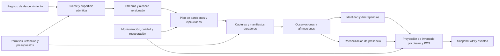

# Fundamentos de Cardeex

Este documento es la entrada canónica de Cardeex, actualizada el 7 de septiembre de 2026. Contiene la misión aprobada por Elias y la base de diseño desarrollada por encargo suyo. Los contratos especializados enlazados aquí forman parte de esa base. Las decisiones de arquitectura son decisiones de diseño; no equivalen a prestaciones demostradas de un producto desplegado.

Una instrucción posterior de Elias se registra aquí antes de consolidarse. Una contradicción entre contrato y prosa es un defecto que bloquea la parte afectada, nunca una licencia para elegir silenciosamente una versión. Obsidian y Graphify son vistas derivadas.

## 1. Frontera absoluta del proyecto

Cardeex es un proyecto totalmente nuevo. **No es una continuación, refactor, sustituto ni mezcla de Cardex o Cardeep.** No se heredan código, datos, recetas, arquitectura, decisiones, taxonomías, métricas ni conocimiento de esos proyectos.

Compartir el dominio de los vehículos no crea relación entre ellos. Obsidian y Graphify también deben usar vaults y grafos independientes.

Elias autorizó consultar Cardex y Cardeep en modo de solo lectura como fuentes históricas comparativas. Se conservan procedencia y límites del hallazgo, se contrasta su razonamiento y se toma una decisión nueva en Cardeex. El encargo de desarrollar esta base autoriza ese rediseño independiente; no autoriza importar sus implementaciones, datos, recetas o grafos.

## 2. Objetivo al 100%

Construir y mantener viva una API del inventario de vehículos que se publican digitalmente en:

- España
- Francia
- Alemania
- Países Bajos
- Bélgica
- Suiza

La ambición final es cubrir el 100% del universo digital observable: desde grandes plataformas hasta la web de un concesionario, compraventa, garaje o desguace pequeño, siempre que exista inventario de vehículos publicado digitalmente.

Para cada fuente y entidad relevante, Cardeex debe poder:

1. Descubrirla y clasificarla.
2. Obtener todo su stock digital observable.
3. Normalizarlo sin perder la evidencia original.
4. Servir el estado actual mediante una API viva.
5. Registrar el delta: altas, bajas y cambios, incluidos precio y fotografías.
6. Conservar historial y procedencia dentro de la retención y derechos aplicables, haciendo visibles sus límites.
7. Guardar la receta reproducible de adquisición.
8. Ordenar y consultar por país, provincia o región, ciudad y punto de venta.
9. Asignar identificadores únicos y estables a las entidades y puntos de venta.
10. Detectar fallos, alertar con el origen exacto, intentar la recuperación y aislar el fallo para que Cardeex no se caiga.

El 100% se refiere al inventario **publicado digitalmente y observable**. Cardeex no puede conocer vehículos que nunca se hayan publicado por ningún medio accesible.

## 3. Unidad de monitorización y modelo conceptual

Una fuente o plataforma es el sistema que Cardeex monitoriza. Quien publica en ella no se convierte automáticamente en dealer o punto de venta.

Ejemplo aprobado: si Juan publica un único coche en AutoScout24 España, AutoScout24 es la fuente monitorizada; Juan es un publicador particular vinculado a ese anuncio. Juan no es por ello un punto de venta.

Las entidades se relacionan mediante vínculos con evidencia y validez temporal. El siguiente recorrido es explicativo; **no es una jerarquía obligatoria ni una cadena de claves foráneas**:

```text
source/platform
  -> publisher account
  -> seller
  -> legal entity
  -> point of sale
  -> listing
  -> canonical vehicle
  -> observations/history
```

No todos los eslabones existirán o podrán resolverse para cada anuncio. El modelo debe admitir identidad desconocida, parcial o probabilística sin inventar relaciones.

### Entidades que deben permanecer separadas

- **Fuente/plataforma:** lugar digital observado; puede alojar inventario propio o de terceros.
- **Cuenta publicadora:** identidad técnica que publica dentro de una fuente.
- **Vendedor:** persona u organización que ofrece el vehículo.
- **Entidad legal:** organización jurídicamente identificable, cuando sea resoluble.
- **Punto de venta:** ubicación comercial física o virtual operada por una entidad profesional.
- **Anuncio/listing:** representación específica de una oferta en una fuente.
- **Vehículo canónico:** activo real al que pueden apuntar varios anuncios.
- **Observación:** estado de un anuncio o vehículo visto en un instante determinado.

Un profesional, una entidad legal y un punto de venta tampoco son sinónimos. Un mismo profesional puede operar varios puntos de venta y una plataforma puede mezclar vendedores profesionales y particulares.

Sin cerrar todavía la taxonomía completa, la clasificación mínima deberá distinguir concesionario o compraventa profesional, garaje o taller, desguace, otro vendedor profesional y publicador particular. Un desguace solo cuenta como fuente de vehículos cuando ofrece unidades completas vendibles o reparables; sus piezas no entran en el núcleo.

## 4. Identidad, evidencia e historial

El mismo vehículo puede aparecer simultánea o sucesivamente en varias plataformas. Cardeex debe representarlo como un vehículo canónico relacionado con varios anuncios específicos de fuente.

Reglas iniciales:

- No sobrescribir la evidencia cruda admitida durante su retención. Una supresión por derechos, privacidad o vencimiento se registra y se propaga a derivados y restauraciones; no se promete conservación perpetua.
- No fusionar registros solo por parecido textual.
- Guardar señales, reglas, confianza y versión del proceso de resolución de identidad.
- Hacer que una fusión sea reversible cuando aparezca evidencia contradictoria.
- Distinguir desaparición observada, venta inferida, retirada, caducidad, error de adquisición y baja confirmada.
- Mantener el historial de atributos y medios, no solo la última versión.

## 5. Axioma de modelado

Estas dimensiones son ortogonales y no se deben colapsar:

```text
clase de activo
!= condición
!= canal de venta
!= tipo de vendedor o entidad
!= estado legal o de fin de vida
```

Consecuencias:

- Accidentado, siniestrado o salvage describe condición o historia; no es una clase de vehículo.
- Subasta describe un canal o evento de venta; no una clase de activo ni un tipo de entidad.
- Un desguace entra en el inventario de vehículos solo cuando publica vehículos completos vendibles o reparables. El inventario de piezas queda fuera del núcleo.
- Una caravana o remolque es un activo no autopropulsado y debe distinguirse de un vehículo a motor.

## 6. Medición honesta del 100%

La cobertura no se publicará como un único porcentaje global. La unidad mínima de medición es:

```text
país × clase_de_vehículo × tipo_de_fuente
```

Además, deben separarse al menos:

- universo de fuentes descubierto;
- fuentes clasificadas;
- fuentes técnicamente accesibles;
- fuentes con receta válida;
- fuentes monitorizadas dentro de la frecuencia acordada;
- inventario observado;
- frescura y completitud del inventario;
- cobertura certificada y fecha de la certificación.

La expansión a nuevas clases de vehículo nunca debe diluir ni volver ambiguo el 100% certificado de turismos.

## 7. Alcance aprobado por fases

Principio rector: **diseñar amplio, ejecutar estrecho**. El modelo raíz será `vehicle`, con extensiones tipadas, pero la cobertura se ejecutará por verticales y denominadores separados.

Decisión adicional de Elias: desde la primera integración de una fuente compartida y admitida, la adquisición contemplará `car`, `lcv`, `motorcycle` y `motorhome`. La captura y la certificación son fases distintas: turismos y LCV se normalizan/certifican primero; motos y autocaravanas progresan con sus propias puertas de calidad. Ninguna clase se omite silenciosamente porque el primer parser solo entienda coches. La habilitación efectiva por superficie exige verificar permisos, rutas, coste y capacidad; una limitación queda visible como cobertura pendiente.

«Una pasada» significa una integración y campaña coordinada por fuente. Un feed mixto puede descargarse una vez y distribuirse por clase; superficies o endpoints distintos exigen peticiones distintas, compartiendo infraestructura. La retención cruda permite reprocesar lo adquirido; no recupera anuncios ni medios que nunca se capturaron.

| Orden | Alcance | Decisión |
|---|---|---|
| Núcleo | Turismos | Primera certificación de cobertura al 100%. |
| Núcleo adyacente | Vehículos comerciales ligeros y furgonetas de hasta 3,5 t | Ingerir desde el principio cuando compartan fuente; medir por separado. Son demasiado grandes y cercanos al esquema de coche para omitirlos. |
| Expansión 1 | Motocicletas y scooters | Primera expansión formal por volumen y solapamiento digital. Los ciclomotores serán subtipo separado. |
| Expansión 2 | Autocaravanas y campers | Vertical menor pero de alto valor, con fuerte concentración europea en los países objetivo. |
| Expansión posterior | Camiones pesados de más de 3,5 t | Vertical B2B separada; piloto recomendado en Alemania y Francia, después España y Países Bajos. |
| Posterior y separada | Caravanas y remolques | Activos no autopropulsados; no mezclarlos con autocaravanas. |
| Prioridad baja | Autobuses y autocares | Volumen muy pequeño; abordar después o junto con la vertical pesada. |
| Fuera de Cardeex | Maquinaria agrícola y de construcción | Exige otra ontología, fuentes y compradores; posible producto futuro independiente. |

Quedan fuera de la primera expansión de motos: quads, triciclos, bicicletas eléctricas y vehículos no matriculados, hasta decisión explícita posterior.

Los conceptos de subasta, daño y salvage existirán desde el modelo inicial. Los conectores a subastas B2B autenticadas se posponen hasta después de las fuentes públicas prioritarias.

## 8. Dictamen estratégico aprobado

Ninguna categoría evaluada iguala a los turismos en volumen absoluto. La oportunidad no se decide solo por unidades:

- Los comerciales ligeros combinan volumen material, fuentes compartidas y bajo coste marginal de integración.
- Las motos tienen mucha más rotación de ocasión de la que sugiere la intuición y comparten plataformas y patrones de publicación.
- Las autocaravanas son una pepita de oro: menor volumen, precio alto, concentración relevante en los países objetivo y buen solapamiento digital.
- Los pesados merecen una vertical posterior por valor B2B y concentración de fuentes, no por volumen unitario.
- Autobuses y autocares no justifican prioridad temprana.
- Agricultura y construcción podrían tener valor, pero incluirlas convertiría Cardeex en “todo lo que tenga ruedas” y rompería el foco y el modelo.

Formulación acordada:

> Cardeex nace sobre una entidad genérica `vehicle`; opera primero turismos y furgonetas; incorpora después motos y scooters, autocaravanas y finalmente pesados. Así preservamos la ambición sin convertir el proyecto en “todo lo que tenga ruedas”.

## 9. Requisitos de fiabilidad ya expresados

La arquitectura especializada desarrolla los siguientes requisitos:

- aislamiento de fallos por fuente y receta;
- alertas con causa y origen exactos;
- reintentos y autorreparación controlados;
- degradación parcial en vez de caída global;
- observabilidad de frescura, volumen, errores y cambios anómalos;
- recetas versionadas, reproducibles y auditables;
- historial inmutable o reconstruible de observaciones y transformaciones.

Las frecuencias y prestaciones se expresan como objetivos con denominador, ventana y pruebas, nunca como resultados ya alcanzados.

## 10. Estado y punto de continuación

Elias encargó desarrollar autónomamente la base completa de arquitectura y preparación: inventario vivo por dealer, escala de miles de millones, deduplicación reversible, divergencias, expansión y verificación. Esta base concreta ese encargo. Los únicos programas de este paquete verifican especificaciones; no hay producto, scrapers, infraestructura desplegada ni inventario real.

El siguiente trabajo es **diseñar la estrategia de descubrimiento a gran escala de fuentes, profesionales y puntos de venta**, usando el contrato de entrada del apartado 14. Después se diseña la estrategia de adquisición y scraping por superficie usando el apartado 15. No se han ejecutado esas campañas ni se han concedido permisos de acceso a terceros.

Los límites empíricos —carga real, distribución de anuncios, cuotas de proveedores, permisos por superficie, rendimiento y calibración de identidad— tienen puertas de aceptación y comportamiento seguro definidos. Se resuelven con evidencia antes de habilitar la capacidad correspondiente, sin impedir construir y probar el núcleo con datos sintéticos.

## 11. Evidencia cuantitativa

La investigación, sus cifras, fuentes y limitaciones se conservan en [Evaluación del alcance de vehículos](research/vehicle-scope-2026-09-07.md).

## 12. Constitución de la fábrica

### 12.1 Qué se construye y cómo se divide

Cardeex mantiene un inventario digital observado, con historia y calidad explícita. Un anuncio es una oferta publicada; una observación es evidencia temporal; un vehículo es una hipótesis de identidad del activo; un dealer es un vendedor profesional. La API de un dealer es una proyección contractual de su inventario, no una base de datos ni un scraper privado duplicado para cada cliente.



| Proyecto de ingeniería | Responsabilidad exclusiva | Contrato canónico |
|---|---|---|
| P0. Constitución y registro | Alcance, admisión, definición de cobertura, entrada de descubrimiento | Este documento; [control.schema.json](../contracts/control.schema.json) |
| P1. Dominio y evidencia | Identidades, relaciones temporales, observaciones, atributos, raw y resolución | [01-domain-and-evidence.md](architecture/01-domain-and-evidence.md); [domain.schema.json](../contracts/domain.schema.json) |
| P2. Inventario y API | Presencia, reconciliación, dealer/POS, snapshots, eventos y consumidores | [02-inventory-and-api.md](architecture/02-inventory-and-api.md); [openapi.yaml](../contracts/openapi.yaml) |
| P3. Ejecución y operación | Persistencia, colas, aislamiento, escalado, seguridad, retención y recuperación | [03-runtime-and-operations.md](architecture/03-runtime-and-operations.md); [capacity-model.json](../contracts/capacity-model.json) |
| P4. Aseguramiento y construcción | Escenarios adversariales, puertas de calidad, secuencia de entrega | [04-verification-and-build-order.md](architecture/04-verification-and-build-order.md); [acceptance-cases.json](../contracts/acceptance-cases.json) |

Una responsabilidad tiene un solo propietario lógico aunque al principio varios módulos compartan proceso o almacenamiento. Los índices de búsqueda, el lago analítico, la caché y los grafos son derivados; no resuelven disputas entre hechos por ser «la última copia».

### 12.2 Invariantes transversales

| ID | Regla obligatoria | Cómo se falsaría |
|---|---|---|
| FND-001 | Fuente, superficie, cuenta publicadora, vendedor, entidad legal, POS, anuncio, observación, vehículo y cliente API tienen identidades distintas. | Un cambio de dominio cambia el dealer; un particular crea automáticamente un POS. |
| FND-002 | Toda conclusión publicada tiene evidencia y versión de decisión rastreables, o estado explícito de evidencia no disponible por política. | Se publica un atributo sin origen o se fabrica una fecha original. |
| FND-003 | La adquisición es reintentable; los efectos se aplican con idempotencia y orden local definido. | Una entrega duplicada duplica stock o adelanta artificialmente una secuencia. |
| FND-004 | Un fallo o barrido parcial nunca demuestra ausencia, venta ni inventario cero. | Una respuesta 429 provoca bajas masivas. |
| FND-005 | Ninguna ausencia de una clase/partición se aplica a otra ni a una revisión de alcance diferente. | Un barrido de coches retira motos, o un cambio de filtros borra stock. |
| FND-006 | Identidad y atributos comerciales se resuelven separadamente. | Un nuevo precio crea otro vehículo; dos precios entre portales se funden en uno. |
| FND-007 | Una fusión de identidad se puede explicar y deshacer sin borrar testimonios. | Un split no reconstruye las asociaciones originales ni corrige consumidores. |
| FND-008 | Captura, observación, conocimiento, publicación y expiración son tiempos diferentes. | Una respuesta antigua recibida tarde sobrescribe estado más reciente. |
| FND-009 | Cada inventario informa alcance, asignación, frescura, completitud y salud; desconocido no equivale a cero. | La API responde «0 vehículos» al perder acceso. |
| FND-010 | Una instantánea y su continuación de eventos no pierden cambios en el límite. | Un cambio entre la última página y la suscripción nunca llega al cliente. |
| FND-011 | El aislamiento del cliente API se comprueba en cada lectura, página, evento, exportación y medio. | Un cursor de otro cliente revela datos. |
| FND-012 | Derechos y supresiones se aplican también a cachés, derivados, eventos pendientes y restauraciones. | Un replay o backup resucita datos suprimidos. |
| FND-013 | Miles de millones históricos no se presentan como miles de millones simultáneamente activos. | El dimensionamiento usa una única cifra «N anuncios» sin ventana ni tipo. |
| FND-014 | Ningún denominador desconocido se convierte en 100%; las exclusiones siguen visibles. | Solo se mide sobre fuentes accesibles y se ocultan las bloqueadas. |
| FND-015 | Cambios de esquema, clasificación, receta, identidad y política tienen versiones independientes y migración explícita. | Reprocesar con otro parser produce ventas o cambia silenciosamente la semántica de un campo. |
| FND-016 | Una decisión automática tiene límites, evidencia, rollback y métricas propios. | Un agente publica una nueva receta, cambia permisos o fusiona entidades sin pasar puertas. |

### 12.3 Alternativas y elección

Se elige un núcleo de datos con evidencia duradera y módulos con contratos independientes. Permite probar cada límite, reconstruir proyecciones y sustituir componentes físicos sin cambiar identidades.

Un sistema independiente por dealer/clase facilitaría alguna personalización inicial, pero multiplicaría conectores, divergencias y operaciones; se descarta como arquitectura de almacenamiento. Un grafo universal mutable como única base simplificaría consultas de relaciones, pero acoplaría identidad incierta, historia, serving y carga masiva; el grafo queda como vista o índice especializado. Los módulos podrán empezar juntos y separarse por límites medidos según P3.

### 12.4 Versionado y cambios

Las reglas DEBE/NO DEBE son normativas. Los ejemplos son sintéticos. Las cifras de capacidad son supuestos calculados y los SLO son objetivos hasta superar sus pruebas. Una recomendación técnica citada no es una autorización contractual de una fuente.

Una modificación declara: motivo, contratos afectados, compatibilidad de lectura/escritura, migración, backfill/replay, costo esperado, pruebas, rollback y responsable. Se guarda en la modificación Git de su documento, sin crear un ADR o checkpoint por cada conversación. Un cambio incompatible de API necesita versión mayor; añadir un país o una clase requiere revisar alcance, atributos, derechos, métricas y pruebas.

## 13. Registro de fuentes y admisión

### 13.1 Fuente, superficie y stream

- `source_id`: sistema publicador reconocible, independiente de dominios, tecnologías y propietarios comerciales cambiantes. Una red de webs que usa el mismo DMS no es por ello una sola fuente.
- `surface_id`: vía de acceso con contrato, autorización, formato y límites propios: API, feed, web o exportación. La misma marca puede tener superficies regionales no equivalentes.
- `listing_namespace_id`: espacio donde un identificador externo conserva significado. Es distinto de la superficie: API y HTML pueden mostrar el mismo anuncio; si no se demuestra, se conservan namespaces separados.
- `stream_id`: universo lógico a adquirir y reconciliar. Mantiene un alcance versionado con país de mercado, clases permitidas y filtros estables. Un stream mixto puede producir varias clases; tiene un manifiesto común y vistas por clase sin atribuir completitud inexistente a cada una.
- `partition_plan`: descomposición de un alcance, con predicados y límites explícitos; las particiones no son identidades de anuncio. Los filtros mutables, como precio, exigen cerrar sobre la unión comparable del stream.
- `plan_revision` es una revisión decimal, `plan_sha256` verifica el artefacto de plan canónico y `partition_key` permite el lookup determinista del predicado dentro del contexto registrado; ninguno sustituye `plan_id`/`partition_id` ni identifica un anuncio.
- `run_id`: intento lógico de ejecución de un alcance y versión de plan; contiene intentos de fetch y sus artefactos. El proceso que ejecuta un run puede reiniciarse muchas veces.

No se coloca `dealer_id` resuelto dentro de una clave inmutable de captura: las asociaciones se pueden corregir. Un stream de una cuenta profesional usa su identidad de origen; su resolución a dealer/POS es una relación versionada.

Clases, países o vías de acceso con derechos, capacidades o cadencias diferentes pueden requerir streams separados. Compartir conector y capturas admitidas no implica certificar clases no observadas. Un límite de resultados solo puede constar como acotado y verificado o desconocido: una prueba finita nunca demuestra capacidad infinita.

La documentación oficial de mobile.de limita los resultados paginables y distingue búsqueda de descarga de detalle. Esto justifica exigir en el contrato evidencia de límites y capacidades por superficie; no prueba acceso autorizado de Cardeex. [Search API](https://services.mobile.de/docs/search-api.html).

### 13.2 Taxonomía de fuente y geografía

`source_type` toma uno de: `marketplace`, `dealer_owned`, `manufacturer_inventory`, `auction`, `classifieds`, `salvage_complete_vehicles`, `authorized_aggregator`, `unknown`. El tipo describe el sistema observado, no la identidad jurídica de sus publicadores. Un directorio sin inventario es evidencia de descubrimiento, no fuente de stock certificada. Una empresa que opera distintos tipos se modela con varias superficies y clasificaciones justificadas; no se deduce el tipo por el nombre.

Se guardan por separado `market_country`, ubicación publicada del vehículo, ubicación del POS, domicilio de entidad legal, idioma y región de almacenamiento. Países de mercado iniciales: `ES`, `FR`, `DE`, `NL`, `BE`, `CH`. Una web en alemán no demuestra ubicación alemana. Provincias/cantones/regiones conservan código oficial cuando verificable, texto original, fuente de geocodificación y precisión; no se impone el modelo español a los seis países.

### 13.3 Ciclo de admisión

```text
candidate → classified → assessed → admitted → onboarding → monitored
                   ↘ rejected      ↘ blocked     ↘ quarantined
monitored → degraded / suspended / retired
```

Cada transición requiere actor, tiempo, revisión esperada y evidencia. `admitted` autoriza técnicamente planificar el alcance permitido; no certifica cobertura ni calidad. `suspended` cancela permisos operativos futuros, conserva historia admisible y activa las reglas de acceso/retención que correspondan. `retired` requiere evidencia de cierre o decisión de producto, nunca un timeout aislado.

Una admisión tiene superficie, países/clases, finalidad, fundamento/contrato, usos de API/media/derivados, presupuesto, política de retención, responsable, fecha de revisión y vencimiento. Los detalles jurídicos privados se referencian por ID restringido; no se incrustan en el repositorio ni en logs. Una admisión caducada no genera nuevo trabajo. El worker vuelve a comprobarla antes de cada acceso y antes de publicar.

La barrera de adquisición falla cerrada: exige admisión `approved` vigente y sin revisión vencida, `acquire_inventory=true`, capacidades vigentes y fuente en `onboarding`, `monitored` o `degraded`. `admitted` permite planificar, no iniciar fetch por sí solo. Una decisión `blocked`, `expired` o `revoked` lleva `acquire_inventory=false`; un cache de derechos antiguo nunca prevalece sobre su estado vigente. Conservar o servir evidencia anterior requiere sus derechos propios, no se deduce automáticamente de permiso de adquisición.

Para promoción `onboarding → monitored` se exige: namespace verificado; manifiesto de capacidades; esquema; corpus de prueba; límites; salida incremental definida; reconciliación definida; política de cambios y rollbacks; métricas por alcance; alertas comprobadas y evidencia de admisión vigente. Si la superficie no ofrece borrados ni enumeración completa, puede monitorizar positivos con `negative_evidence_capability=none`; no certifica ausencias.

## 14. Contrato para el próximo proyecto: descubrimiento

### 14.1 Entrada, salida y fronteras

El próximo proyecto elegirá las estrategias de búsqueda, combinaciones de fuentes y orden geográfico. La base le entrega un esquema de `DiscoveryCandidate`, estado de admisión y definición de cobertura. No presupone listas de dealers, motores de búsqueda, proveedores de directorios ni heurísticas específicas de scraping.

Cada candidato entrega obligatoriamente:

1. ID de candidato, tipo reclamado (`source`, `publisher_account`, `professional_seller`, `point_of_sale` o `unknown`) y momento de descubrimiento.
2. Referencias de evidencia admisible y localizador observado saneado; método y versión de descubrimiento.
3. País(es) reclamado(s), clases sospechadas y señales originales; desconocido es válido, no inventado.
4. Candidatos relacionados y naturaleza de la relación: identidad posible, ubicación, operación o publicación. No se fusionan por nombre/dominio.
5. Decisión (`unreviewed`, `accepted`, `duplicate_candidate`, `rejected`, `needs_evidence`), regla, motivo y responsable cuando exista.
6. Próxima revisión y procedencia independiente de cada afirmación; rechazo no borra el candidato ni demuestra inexistencia.

Un candidato duplicado puede apuntar a otro candidato o a una entidad existente con evidencia; no se convierte en dealer duplicado ni se elimina la huella de su descubrimiento. La aceptación de un candidato permite incorporarlo al registro, no iniciar adquisición de inventario automáticamente.

### 14.2 Requisitos de la estrategia que deberá diseñarse

El resultado del siguiente proyecto incluirá un plan finito por país/clase/tipo de fuente, tratamiento de largas colas, generación y normalización de candidatos, evidencia de pertenencia profesional y POS, comprobación de actividad, detección de duplicados de entidad, muestreo independiente, revisión periódica y presupuesto por entidad válida encontrada. Deberá mostrar dónde no sabe medir exhaustividad.

Las facetas pueden producir espacios de URL prácticamente ilimitados. Por ello cada método deberá definir frontera, política de URL, clave de visita, presupuesto y condición de parada verificable. Es una exigencia de diseño, no una receta de rastreo ya escogida. [Google, navegación por facetas](https://developers.google.com/crawling/docs/faceted-navigation).

### 14.3 Medición sin esconder el desconocido

Para cada celda `market_country × vehicle_class × source_type` se guarda un `universe_version`, fecha y método. Los contadores mínimos son candidatos, fuentes clasificadas, rechazadas con motivo, admitidas, bloqueadas, monitorizadas, en plazo, con censos válidos y con identidad de dealer/POS resuelta. Contadores de fuentes y de entidades no se suman entre sí.

Tres denominadores distintos:

| Denominador | Qué permite afirmar | Qué no permite afirmar |
|---|---|---|
| Registro descubierto versionado | «X de Y fuentes conocidas están monitorizadas», con bloqueadas visibles | «Conocemos todas las fuentes existentes» |
| Universo finito demostrable de una superficie | Completitud de un censo dentro de su alcance/ventana y evidencia contractual | Cobertura simultánea instantánea de un portal cambiante |
| Universo abierto estimado | Estimación, intervalo y sesgos del método; exploración pendiente | 100% exacto por saturación de búsquedas o muestreo |

`coverage_ratio = certified_units / declared_comparable_units` solo existe si ambas unidades, alcance, ventana y denominador están demostrados. Denominador desconocido produce `null`, no 0 ni 1. Una celda vacía exige evidencia para distinguir inexistencia de falta de descubrimiento. Los solapamientos entre portales no aumentan la cobertura de vehículos: se informa aparte número de anuncios, candidatos de vehículo y activos resueltos.

Una certificación caduca al cambiar alcance, namespace, plan, límites de API, permisos o evidencia incompatible. Su vigencia operativa máxima y revisiones se fijan en P3. Las cifras públicas son versiones de esas mediciones con incertidumbre visible. El objetivo del 100% guía la exploración; no se certifica un universo abierto solo por haber agotado un presupuesto.

## 15. Contrato para el proyecto posterior: adquisición y scraping

### 15.1 Manifiesto de capacidades, sin escoger todavía recetas

Cada conector declara transporte y superficies; clases y filtros soportados; namespace de ID; tipo de paginación; tope real de resultados; estabilidad del orden; tamaño máximo de respuesta; semántica de cursores/fechas; capacidad de snapshot; feed de eliminaciones; autenticación; límites; sensibilidad y derechos por tipo de dato; índice frente a detalle y medios.

No puede afirmar capacidades porque otra fuente del mismo proveedor las tenga. `unknown` exige verificación; una capacidad ausente limita la garantía publicada. Cada receta se identifica por fuente/superficie/alcance/locale y versión de artefacto, no únicamente por dominio. El contrato exacto de extracción se deriva del raw retenido, nunca de una URL que se vuelve a pedir y se llama «replay».

### 15.2 Interfaces lógicas del adaptador

| Operación | Entrada | Salida | Prohibición |
|---|---|---|---|
| `describe_capabilities` | Superficie y revisión de admisión | Manifiesto versionado y evidencia de cada capacidad | Declarar acceso o completitud no comprobados |
| `plan` | Alcance, presupuesto, estado durable | Plan finito de particiones, límites y condición de cierre | Mutar alcance silenciosamente al llegar a un límite |
| `enumerate` | Partición, cursor y token de ejecución | IDs/locators con evidencia, next cursor, resultados/errores | Inferir baja al terminar una página |
| `fetch` | Locator admitido, contexto y validadores | Artefacto/evidencia de resultado y metadatos saneados | Publicar directamente en inventario |
| `extract` | Artefacto retenido y versión de extractor | Observaciones tipadas o cuarentena con razón | Hacer red durante replay o inventar campos |
| `reconcile_input` | Manifiestos de particiones y evidencia de cierre | Candidato de certificado para validación por el núcleo | Autocertificar o borrar stock desde el conector |

La ejecución ofrece al conector red gobernada y secretos por referencia, almacenamiento de evidencia, cursores durables y cancelación. Las políticas, identificadores canónicos, reconciliación, resolución de identidad, SLO y publicación pertenecen al núcleo. Si HTML/API muestran el mismo detalle, la descarga se comparte cuando su identidad y contexto estén probados; no se deduplica por URL sin considerar representación, permiso y variante.

### 15.3 Qué deberá traer la estrategia de scraping

Para cada familia de superficies: priorización de API/feed/acceso acordado; pruebas de completitud; trazado índice→detalle→medios; límites y backoff; particionado estable; tratamiento de altas durante barrido; reconciliación; cadencias factibles; fixtures por país/clase; detección de deriva; recuperación; y coste medido por inventario actualizado. El orden será evidencia y contratos, estrategia, piloto admitido, pruebas, promoción y escalado.

## 16. Gobierno del trabajo y conocimiento

Cada proyecto P0–P4 tiene tareas y puertas en P4. Cada entrega identifica entradas, cambios, pruebas, riesgos reales y salida para el siguiente proyecto. El autor y el revisor pueden ser agentes, pero el revisor examina artefactos y contraejemplos; no basta una votación de opiniones. Las incidencias de datos se enrutan al propietario del campo, identidad, adquisición o serving correspondiente.

Automatización autorizable: reintentos dentro de presupuesto, replay determinista, aislamiento de un stream, rollback a receta aprobada y generación de propuestas. Cambiar derechos, pagar un proveedor, alterar alcance de producto, publicar una afirmación de cobertura o desplegar una receta no certificada requiere la autoridad correspondiente; un texto de una web no puede concederla.

Se mantienen este documento, cuatro contratos de arquitectura por responsabilidad y sus artefactos verificables. No se crean resúmenes de sesión, copias de decisiones ni checkpoints permanentes. Git conserva la evolución. Una investigación solo permanece separada si sostiene una decisión próxima con fuentes reproducibles. La interfaz de Obsidian no forma parte de la documentación operativa.
