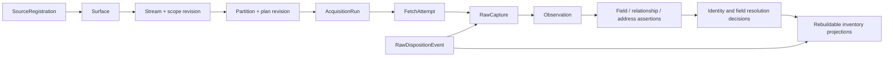

# Dominio, identidad y evidencia

## 1. Alcance y estatus

Este documento define el modelo lógico de P1 y la semántica normativa de [domain.schema.json](../../contracts/domain.schema.json). Es un artefacto de diseño: no hay aquí una base de datos elegida, un extractor desplegado, datos reales ni prestaciones probadas en producción.

P1 recibe de P0 identidades de fuente, superficie, namespace, stream, scope, plan y admisión; emite evidencia tipada, hipótesis de vehículo y decisiones de identidad. P2 es propietario de reconciliación de presencia, inventario por dealer/POS, snapshots y API. P3 es propietario de ejecución, persistencia física, retención operativa y capacidad. Las estrategias concretas de descubrimiento y adquisición quedan fuera de este documento.

Las palabras **DEBE**, **NO DEBE** y **PUEDE** son normativas. Cada regla se identifica como `DOM-nnn` y tiene un contraejemplo verificable en el apartado 15.

## 2. Elección arquitectónica

Se compararon tres formas de modelar el dominio:

1. **Registro mutable de “vehículo actual”**. Es sencillo de consultar, pero pierde discrepancias, confunde anuncio con activo y hace irreversibles las correcciones.
2. **Grafo universal mutable**. Representa relaciones flexibles, pero mezcla observación, resolución, serving y retención en una autoridad difícil de reconstruir a escala.
3. **Evidencia append-only, identidades separadas y proyecciones reconstruibles**. Mantiene raw, afirmaciones y decisiones independientes; las relaciones forman un grafo temporal, mientras P2 sirve vistas materializadas.

Se elige la tercera. El grafo es el modelo lógico de relaciones, no obliga a usar una base de grafos. Los índices, tablas actuales, caches y grafos de consulta son derivados y no resuelven disputas por ser la copia más reciente.



## 3. Vocabulario y fronteras

| Concepto | Identidad y responsabilidad | No significa |
|---|---|---|
| `SourceRegistration` | Sistema publicador reconocible registrado por P0. | Dominio web, propietario comercial o software DMS. |
| `Surface` | Vía admitida con contrato y permisos propios: API, feed, web o exportación. | Fuente completa ni autorización heredable a otra superficie. |
| `listing_namespace_id` | Espacio demostrado en el que un ID externo conserva significado. | `surface_id`; dos superficies solo lo comparten con evidencia. |
| `Stream` | Universo lógico versionado que se adquiere y reconcilia conjuntamente. | Cola física, clase única ni dealer. |
| `Partition` | División finita de trabajo bajo un plan y scope concretos. | Identidad del anuncio ni denominador independiente. |
| `AcquisitionRun` | Ejecución lógica de un plan/scope; sobrevive a reinicios del proceso. | Un único proceso, fetch o transacción global. |
| `FetchAttempt` | Intento de obtener un artefacto dentro de un run. | Observación aceptada. |
| `RawCapture` | Recibo y, si la política lo permite, bytes exactos de una respuesta o importación. | Registro normalizado ni promesa de retención perpetua. |
| `Listing` | Encarnación concreta de un anuncio en un namespace. | Oferta comercial, vehículo o estado de stock global. |
| `Offer` | Proposición comercial contextual presentada por un listing. | Vehículo; puede haber contado y financiación simultáneos. |
| `Vehicle` | Hipótesis canónica revisable sobre un activo físico. | Fila infalible, listing o lugar para un precio global. |
| `PublisherAccount` | Identidad técnica que publica en una fuente. | Seller, entidad legal o POS por defecto. |
| `Seller` | Persona u organización que ofrece una oferta. | Cuenta publicadora, sociedad jurídica o sucursal. |
| `LegalEntity` | Persona jurídica o identidad registral resoluble. | Seller o POS obligatorio. |
| `PointOfSale` | Ubicación comercial física o virtual operada por un profesional. | Dirección textual ni dealer automático. |
| `Observation` | Evidencia temporal producida desde una captura identificada. | Estado de inventario reconciliado. |
| `Tenant` | Cliente y frontera de autorización de la API de P2/P3. | Dealer, seller, fuente ni parte de una clave de adquisición. |

Todas las entidades nuevas usan UUIDv7 textual en minúsculas. El UUID se trata como opaco: su timestamp mejora localidad aproximada, pero **no** es reloj causal, secuencia de negocio ni prueba de orden. Los tiempos son UTC RFC 3339 acabados en `Z`. Los contadores `uint64` viajan como cadenas decimales y se validan semánticamente contra `0..18446744073709551615`.

## 4. Linaje de adquisición

Toda observación contiene referencias a:

```text
source_id
surface_id
stream_id
partition_id
run_id
fetch_attempt_id
admission_id
scope_revision
plan_id + plan_revision
recipe_version_id + recipe_artifact_sha256
extractor_version_id + extractor_artifact_sha256
```

Estas referencias no se copian para decidir identidad; permiten reproducir qué se observó, con qué permiso y transformación. `run_id` y `fetch_attempt_id` son UUIDv7 opacos. Una clave determinista de idempotencia es un SHA-256 separado; no se sobrecarga el ID. La secuencia `seq` solo ordena dentro de `sequence_scope_id`. Cambiar de scope, epoch o productor crea otro scope de secuencia; nunca se comparan dos `seq` de scopes distintos.

Entrega y procesamiento son **at-least-once**. Reentregar exactamente el mismo sobre conserva `observation_id` e `idempotency_key_sha256`; el consumidor produce un solo efecto lógico. Volver a adquirir la misma representación en otro instante es otra observación. Agotar `uint64` bloquea el scope y exige uno nuevo: está prohibido envolver a cero.

## 5. Identidad de listing y reutilización de IDs

La identidad externa estable es:

```text
(listing_namespace_id, source_listing_key, incarnation)
```

`source_listing_key` es una cadena, no un objeto, y se conserva según la semántica de mayúsculas, ceros y Unicode declarada por el namespace. `listing_id` identifica internamente esa encarnación. La primera encarnación es `"1"`.

Dos superficies pueden compartir namespace solo después de demostrar que el mismo key designa el mismo listing. Si la equivalencia es desconocida, se crean namespaces distintos. País, clase, precio, kilometraje, URL, seller resuelto y superficie **no** entran en la identidad cuando el namespace compartido ya está demostrado.

Una reaparición del mismo key no crea automáticamente nueva encarnación. Se abre `incarnation + 1` cuando hay evidencia incompatible con continuidad —por ejemplo, tombstone seguido de otro activo, solapamiento imposible o identificadores contradictorios— y una regla versionada lo decide. Ante duda se conserva una hipótesis sin sobrescribir la anterior. No se recicla `listing_id`.

Un listing puede presentar varias ofertas simultáneas. Un cambio de cantidad en el mismo contexto crea otra afirmación temporal, no otro listing, offer ni vehicle. Un cambio de contexto comercial material —por ejemplo contado frente a cuota mensual condicionada— usa ofertas o contextos distintos.

## 6. Publicador, seller, entidad legal, dealer y POS

No existe una cadena obligatoria de claves foráneas. Las relaciones son afirmaciones M:N con intervalo de validez, tiempo de registro, evidencia, derivación, confianza y supersesión. Puede existir:

- listing → cuenta publicadora sin seller resuelto;
- cuenta publicadora → varios sellers o varias cuentas → un seller;
- offer → seller sin entidad legal ni POS;
- seller ↔ entidades legales sucesivas o simultáneas con roles distintos;
- POS → seller o entidad legal, con operador cambiado en el tiempo;
- offer → cero, uno o varios POS candidatos hasta resolución.

El vocabulario inicial de predicados está cerrado en el schema: `listing_published_by`, `offer_presented_in_listing`, `publisher_account_represents_seller`, `offer_offered_by`, `seller_corresponds_to_legal_entity`, `point_of_sale_operated_by`, `offer_fulfilled_at` y `listing_describes_vehicle`. Un predicado nuevo exige revisión de registro; no se acepta como string libre.

`SellerClassification.seller_kind` distingue `professional`, `private` y `unknown`. Si es profesional se exige `professional_type`: concesionario franquiciado, compraventa independiente, garaje/taller, operador de salvage/desguace u otro profesional. **Dealer es la vista API del mismo `seller_id` cuya clasificación efectiva es profesional**, no una entidad adicional y no solo el subtipo “concesionario”. Un particular nunca es dealer. Un taller o desguace profesional puede ser dealer en la API para sus vehículos completos in-scope; sus piezas siguen fuera.

P2 puede materializar un `seller_id` efectivo en `DealerInventory`, pero debe conservar `relationship_assertion_id` y la decisión de resolución que lo justifican. Una corrección de seller o POS emite reasignación; no modifica Listing u Offer como si la asociación siempre hubiera sido conocida.

## 7. Observaciones: presencia frente a atributos

`ObservationEnvelope` tiene exactamente dos ramas:

### 7.1 `listing_presence`

Registra una señal puntual: `observed_present`, `source_reports_withdrawn` o `locator_not_found`, con base concreta. No contiene atributos ni afirma el lifecycle reconciliado. Un 404 aislado es `locator_not_found`, no “vendido”. P2 combina estas señales con capacidades, censos comparables y cadencia para producir `observed_present`, `absence_suspected`, `not_observed` o `withdrawn`.

Un HTTP 304 solo puede emitir presencia `observed_present` con base `conditional_not_modified`. Su evidencia apunta al raw del 304 y a `prior_representation_raw_capture_id`. Como un 304 no contiene cuerpo, no crea `listing_attribute_snapshot`, no vuelve a fechar atributos y no finge replay si el raw anterior expiró. Esta lectura coincide con la semántica de [RFC 9110 §15.4.5](https://www.rfc-editor.org/rfc/rfc9110.html#name-304-not-modified).

### 7.2 `listing_attribute_snapshot`

Es un snapshot completo **para un conjunto de campos declarado y versionado**, no para “todo lo que quizá contenía la web”. `snapshot_scope` fija hash del field-set, secciones cubiertas y `complete_for_declared_scope`. Cada campo requerido aparece como `known`, `explicit_null`, `unknown` o `not_applicable`.

Una respuesta truncada, parser abortado o sección inesperadamente inaccesible no se etiqueta completa: se cuarentena y puede conservar una presencia positiva separada. Un scope menor solo es válido si fue declarado antes; no se encoge oportunistamente para aprobar una captura fallida. Si `covered_sections` incluye media, el manifiesto de medios también debe ser completo para ese scope.

Reprocesar bytes retenidos puede emitir otro snapshot con `retained_capture_replay`. Conserva el tiempo original de captura/validez y usa un `recorded_at` nuevo, otro extractor versionado y entradas de derivación. El replay tiene egress deshabilitado; pedir de nuevo la URL sería una captura nueva.

## 8. Afirmaciones de campo y semántica de valores

Un `FieldAssertion` contiene sujeto tipado, JSON Pointer canónico, definición de campo versionada, valor, contexto, intervalo válido, `recorded_at`, localizadores raw, derivación y lista de afirmaciones supersedidas.

El registro de campos es fail-closed. `field_definition_id + revision + sha256` debe existir y declarar sujeto, tipo, unidades permitidas, nullabilidad y contexto. Un path desconocido se conserva en raw y va a cuarentena/propuesta de esquema; no se publica en un campo “extra” mutable. El schema valida la forma y el verificador semántico valida la coincidencia con el registro.

Semántica de valor:

| Estado | Significado | Prohibición |
|---|---|---|
| `known` | La fuente o una derivación versionada afirma un valor tipado. | Usar `""`, `0` o sentinels para desconocido. |
| `explicit_null` | La representación expresó ausencia y la definición admite null. | Inferirlo porque faltó una clave. |
| `unknown` | Cardeex no puede afirmar el valor; exige razón cerrada. | Interpretarlo como borrado o falso. |
| `not_applicable` | Una regla con evidencia demuestra que el campo no aplica. | Usarlo para ocultar un fallo de parser. |

`GeneralFieldAssertion` impide usar `/offer/price`, no admite `Money` y restringe `semantic_role` al tipo de sujeto. El precio utiliza exclusivamente `OfferPriceAssertion`, cuyo sujeto es Offer y cuyo contexto incluye listing, clase de precio, fiscalidad, condición de financiación, mercado y fingerprint. Por construcción el vehículo canónico no tiene precio global.

Cada `EvidenceLocator` fija `raw_capture_id`, SHA-256 completo y localizador dentro de la representación. Que los bytes hayan expirado después no borra la procedencia: una proyección de disponibilidad indica `available`, `expired`, `privacy_deleted` o `never_retained`. Sin bytes no se promete revalidación futura.

## 9. Tiempo bitemporal y correcciones

Se separan cuatro tiempos:

- `captured_at`: cuando se obtuvo o validó la representación;
- `observed_at`: instante al que se refiere la observación Cardeex;
- `valid_time`: intervalo al que una afirmación pretende aplicar en el mundo/fuente;
- `recorded_at`: cuándo Cardeex registró la afirmación o decisión.

Un timestamp publicado por la fuente puede conservarse como afirmación aparte, con precisión e incertidumbre, pero no sustituye esos relojes. Si solo se conoce año o día, no se fabrica un instante. El verificador semántico comprueba `valid_to > valid_from`, `recorded_at` coherente con el proceso y que un replay no avance `valid_from`.

Las correcciones son append-only: una nueva afirmación referencia `supersedes_assertion_ids`. La consulta “qué creíamos en T” usa tiempo de registro; “qué decía la fuente para V según el conocimiento actual” usa validez y supersesiones. Llegar tarde no concede prioridad. UUIDv7 tampoco decide causalidad.

## 10. Raw, retención, privacidad y supresión

`RawCapture` admite `transport=http` y `transport=file_import`; una importación offline no inventa status 200, request ni cabeceras HTTP. HTTP exige `response_status`, `request_fingerprint_sha256` y `headers_sha256`; el import exige en cambio `import_manifest_sha256` e `importer_ref`, y ambas ramas son excluyentes. La representación es una de:

- `stored_body`: bytes en almacenamiento de objetos, SHA-256 completo y longitud;
- `empty_by_protocol`: cuerpo vacío, como 304;
- `metadata_only_by_policy`: se calculó recibo pero la política prohibió conservar bytes.

Los bytes y metadatos de adquisición admitidos son inmutables mientras existen. “Inmutable” no significa “eterno”. Cada captura referencia admisión, política de retención, clasificación de privacidad y revisión. Autenticación, cookies, tokens, query secrets y cabeceras sensibles se eliminan antes de calcular el recibo persistente; solo se guarda referencia opaca al secreto cuando sea necesaria fuera de P1.

Caducidad, revocación de derechos, privacidad, cuarentena y legal hold se expresan con `RawDispositionEvent`; nunca se reescribe el payload para simular que siempre estuvo vacío. Una supresión elimina o vuelve inaccesibles los bytes y propaga invalidación a afirmaciones servibles, caches, medios, índices, eventos pendientes y restauraciones. El recibo mínimo solo conserva IDs, política, acción y autoridad que sean legalmente admisibles; no conserva una URL o digest si permiten reidentificar contra la política.

Content-addressed no significa deduplicación global visible. Cada captura declara `rights_domain_id`, `retention_domain_id` y `storage_security_domain_id`. Un mismo checksum solo PUEDE compartir almacenamiento físico cuando derechos, retención y aislamiento son compatibles; cada captura conserva autorización y material de acceso revocables por separado. El SHA-256 no es una URL, capability ni clave pública de lookup. Una consulta por digest queda limitada al dominio autorizado, para que un tenant o licencia no confirme ni recupere contenido de otro y para que crypto-shred/supresión no dependan de un derecho ajeno.

Toda restauración aplica primero el ledger de disposiciones y después reconstruye derivados. Un backup no resucita material suprimido. Si la evidencia deja de estar disponible, las respuestas que dependan de ella lo declaran; no se reemplaza por una recaptura silenciosa.

## 11. Medios, dinero, unidades e idiomas

### Medios

Se separan `MediaOccurrence` —aparición ordenada dentro de un listing— y `media_asset_id` —bytes adquiridos—. La URL se representa mediante referencia protegida y fingerprint; no es identidad del asset. El SHA-256 de contenido tampoco demuestra por sí solo el mismo vehículo: watermarks e imágenes de catálogo existen.

Cada snapshot declara si la galería era completa, estaba fuera de scope o no disponible. Solo dos manifiestos completos comparables permiten afirmar una retirada de fotografía. Falta en snapshot parcial no es borrado. Derechos pueden permitir observar la referencia pero prohibir almacenar o servir bytes; `not_fetched.reason=rights_disallow` lo expresa sin falsear un error.

### Dinero

Los importes usan cadenas decimales exactas y código de moneda de tres letras validado contra el registro aprobado. No se usan `float` ni se presupone número de decimales. `24990 EUR`, `199 EUR/mes`, precio financiado, neto, bruto, reserva y puja actual son contextos distintos. Las condiciones originales siguen en afirmaciones/evidencia; una conversión monetaria es otra derivación con tasa, instante y versión, nunca sustitución.

### Unidades y precisión

Las cantidades usan decimal string y unidad cerrada (`km`, `mi`, `kg`, `mm`, `cm3`, `m3`, `kW`, `kWh`, `L/100km`, `g/km` en v1). El perfil servido restringe además cada campo: mileage `km|mi`, potencia `kW`, masas `kg`, volumen de carga `m3` y cilindrada `cm3`; otras unidades solo entran tras una conversión atribuida o permanecen como afirmación no publicable. Se conserva el valor/unidad de origen y cada conversión referencia entradas, regla, redondeo y precisión. PS no se etiqueta kW sin conversión; una fecha “2021” no se convierte en `2021-01-01`.

Los enteros JSON están limitados al rango interoperable exacto ±(2^53−1). Cantidades o contadores mayores usan decimal string.

### Idiomas

El texto conocido no puede ser vacío y PUEDE llevar tag BCP 47. Ausencia de tag es idioma desconocido, no idioma del país de mercado. Texto fuente, texto normalizado y traducción son afirmaciones distintas con linaje; una traducción nunca sobrescribe el original. El patrón del schema cubre tags canónicos comunes y una validación de registro comprueba tags admitidos según [RFC 5646](https://www.rfc-editor.org/rfc/rfc5646.html).

## 12. Vehículo común, extensiones y elegibilidad

`VehicleProfile` es una proyección reconstruible: cada valor efectivo referencia su `assertion_id`. La raíz común contiene marca, modelo, variante, primera matriculación, kilometraje, potencia, energía, transmisión, condición, identificadores y elegibilidad registral. No contiene precio, seller ni lifecycle del listing.

La clasificación usa taxonomía versionada y exactamente una extensión:

| `vehicle_class` | Extensión inicial | Distinciones mínimas |
|---|---|---|
| `car` | `CarExtension` | carrocería, puertas y asientos sin confundir MPV con LCV. |
| `lcv` | `LcvExtension` | carrocería comercial, masa máxima, carga y volumen; objetivo hasta 3,5 t. |
| `motorcycle` | `MotorcycleExtension` | `motorcycle`, `scooter` o `moped`, estilo y cilindrada. |
| `motorhome` | `MotorhomeExtension` | `motorhome` o `campervan`, plazas de dormir, masa y vehículo base. |
| `unknown` | `UnknownVehicleExtension` | razón, etiqueta fuente y candidatos; siempre `serving_state=quarantined`. |

Clase, condición, canal, seller y estado legal son ortogonales. `salvage` no es clase. `van` textual no decide entre turismo y LCV sin reglas/evidencia. Masa desconocida no fuerza clase; una corrección `car → lcv` conserva vehicle y listings y reproyecta contadores, sin simular venta.

Interpretación conservadora del alcance moto: que falten matrícula o fecha de primera matriculación produce `road_registration_eligibility=unknown`; no demuestra que el activo sea no matriculable ni que esté explícitamente sin matricular. Un vehículo nuevo legítimo puede carecer de primera matriculación. La exclusión vigente de vehículos no matriculados solo se aplica cuando evidencia afirmativa y compatible demuestra ese estado fuera del scope; `unknown` permanece candidato y no se certifica hasta resolverlo. Esta precisión evita convertir una ausencia de campo en exclusión, sin ampliar silenciosamente el scope aprobado.

## 13. Deduplicación, merge/split y divergencias

### Listing antes que vehicle

Primero se deduplica la entrega por idempotencia y el listing por namespace/key/incarnation. Después se generan candidatos de vehicle. Identidad nunca depende de precio, kilometraje, clase inferida, URL mutable o dealer resuelto.

VIN, chasis, matrícula, stock ID, atributos, temporalidad y medios son señales con polaridad y procedencia; ninguna es PK universal. Un VIN puede faltar, estar truncado, ser histórico/no estándar, estar mal publicado o entrar en conflicto. Dos coches de flota iguales no se fusionan por semejanza.

### Decisiones reversibles

`IdentityResolutionDecision` registra `assign`, `unassign`, `merge`, `split` o `reject_match`; exige actor, política/version/hash, señales de apoyo y contradicción, confianza, cambios de membresía y decisiones supersedidas. `reject_match` no cambia membresía. Un merge no borra IDs, observaciones ni asociaciones anteriores; un split supersede la decisión y reubica memberships. P2 emite correcciones para consumidores.

La transitividad no se asume ciegamente: si A≈B y B≈C pero A contradice C, el clúster se bloquea o revisa. Un umbral automático solo se habilita después de calibración por clase, país, fuente y población; antes produce propuestas, no fusiones efectivas.

### Divergencia por campo y contexto

Las afirmaciones nunca se compactan por “último valor” antes de conservar evidencia. Se comparan por sujeto, definición de campo, contexto y valid time. Dos precios de offers/canales distintos son una diferencia contextual esperada; dos mileages incompatibles del mismo vehículo y tiempo son conflicto. `FieldDivergence` conserva todas las assertion IDs, estado y política de resolución. La vista efectiva puede elegir un valor, mostrar un rango o responder desconocido sin borrar competidores.

Cantidad de portales no equivale a independencia. Cada localizador PUEDE declarar `origin_claim_id`, `dependency_group_id` y cadena de sindicación. Tres portales que replican el mismo feed cuentan como una familia de evidencia correlacionada, no tres votos. Si el origen es desconocido, la independencia también es desconocida y no se bonifica. La resolución se calibra por campo, contexto, fuente y tiempo; considera latencia de sindicación e incertidumbre temporal. Se prohíbe una mayoría global de fuentes como regla universal.

## 14. Dirección y geografía temporal

Una dirección es entidad/afirmación temporal, no columnas actuales pegadas al seller. `AddressAssertion` enlaza cualquier sujeto admisible con `address_id`, `valid_time`, `recorded_at`, raw y derivación. Domicilio legal, ubicación publicada del vehículo y POS son contextos distintos.

Se conservan texto original, idioma, líneas, postal code string, localidad y niveles administrativos genéricos con code system. No se impone “provincia” española a Francia, Alemania, Países Bajos, Bélgica o Suiza. Coordenadas usan campos explícitos latitude/longitude en `EPSG:4326`, precisión, método y, si procede, proveedor/versión. Geocodificar una localidad no produce precisión rooftop. Un cambio de operador o dirección cierra/supersede la relación; no reescribe historia.

## 15. Invariantes y escenarios negativos verificables

Las validaciones marcadas “schema” se ejercen con Draft 2020-12 y format assertion habilitado. Las restantes requieren fixtures/ledger semántico; que JSON valide no prueba su verdad.

| ID | Invariante | Escenario negativo y resultado esperado |
|---|---|---|
| DOM-001 | Toda entidad nueva usa UUIDv7 opaco y tipos de entidad no se intercambian. | Pasar UUIDv4 o seller ref donde el predicado exige POS: schema rechaza. |
| DOM-002 | UUIDv7 no ordena causalidad. | Llega UUID mayor con `valid_time` anterior: ledger conserva orden efectivo, no gana por UUID. |
| DOM-003 | Toda observación referencia source/surface/stream/partition/run/fetch/admission/scope/plan/recipe/extractor. | Quitar cualquier ref requerida: schema rechaza. |
| DOM-004 | Identidad externa de listing es namespace + key string + incarnation. | Enviar key objeto o omitir namespace: schema rechaza. |
| DOM-005 | Reutilización demostrada del ID abre incarnation y listing nuevos. | Reusar `(namespace,key,1)` para activo incompatible: test de identidad bloquea overwrite. |
| DOM-006 | Precio, km, clase, país, URL, surface y seller no forman identidad. | Cambiar precio crea otro listing/vehicle: test exige IDs estables. |
| DOM-007 | PublisherAccount, Seller, LegalEntity y POS son independientes. | Particular publicado crea POS automáticamente: test exige cero relación sin evidencia. |
| DOM-008 | Dealer es el mismo seller profesional, sea trader, taller, salvage u otro profesional. | Crear dealer ID paralelo o excluir garage profesional: test falla clasificación. |
| DOM-009 | Relaciones son M:N, temporales, evidenciadas y supersedibles. | Cambiar POS mediante FK mutable sin assertions: reconstrucción histórica falla. |
| DOM-010 | Listing, Offer y Vehicle permanecen separados; precio pertenece a Offer. | General assertion o Vehicle usa `/offer/price`: schema rechaza. |
| DOM-011 | Presence y attribute snapshot son ramas disjuntas. | Añadir `field_assertions` a presence o `presence_signal` a snapshot: schema rechaza. |
| DOM-012 | Snapshot es completo para field-set declarado; fallo no encoge scope. | Raw truncado marcado completo: verificador de field-set cuarentena. |
| DOM-013 | 304 solo produce presence y apunta al raw previo. | Snapshot con `not_modified` o 304 sin prior raw ID: schema rechaza. |
| DOM-014 | `known`, `explicit_null`, `unknown` y `not_applicable` son disjuntos. | Usar JSON null, valor con unknown o ausencia sin razón: schema rechaza. |
| DOM-015 | Campo/evidencia llevan definición, hash, locator y dependencia/origen cuando sea resoluble. | Path no registrado, digest truncado o tres sindicaciones contadas independientes: se rechaza/cuarentena. |
| DOM-016 | Valid time y recorded time son ejes distintos. | Replay cambia `valid_from` a fecha de replay: test semántico rechaza. |
| DOM-017 | Correcciones añaden supersesiones; no reescriben testimonios. | Update elimina assertion anterior: reconstrucción as-of detecta pérdida. |
| DOM-018 | Raw es inmutable durante retención, no perpetuo; dedupe respeta dominios de derechos, retención y seguridad. | Cambiar bytes bajo mismo ID o consultar SHA desde otra licencia: hash/aislamiento falla. |
| DOM-019 | Supresión se propaga a derivados/restauraciones y no destruye evidencia autorizada de otro dominio. | Restaurar backup o crypto-shred global por hash: test exige ledger y alcance exacto. |
| DOM-020 | Occurrence, locator y media asset son identidades diferentes. | Dos URLs o hashes iguales fusionan vehículos: test exige solo señal, no merge. |
| DOM-021 | Money usa decimal string, moneda y contexto de Offer. | `199/month` se publica como precio contado o amount float: schema/política rechaza. |
| DOM-022 | Unidad y precisión originales sobreviven a normalización. | Etiquetar 100 PS como 100 kW: fixture exige derivación/conversión versionada. |
| DOM-023 | Texto fuente, normalizado y traducido son assertions separadas. | Traducción sobrescribe original o país determina idioma: prueba de linaje falla. |
| DOM-024 | VehicleProfile usa raíz común y exactamente una extensión coherente. | `vehicle_class=car` con MotorcycleExtension: schema rechaza. |
| DOM-025 | `vehicle_class=unknown` queda quarantined. | Unknown servido como car o `eligible`: schema/política rechaza. |
| DOM-026 | Elegibilidad vial unknown no equivale a ineligible. | Moto sin matrícula se excluye: fixture exige unknown y conserva candidato. |
| DOM-027 | Dedupe de vehicle es conservadora y usa señales positivas/negativas. | Flota similar se fusiona solo por texto: policy test rechaza decisión efectiva. |
| DOM-028 | VIN/chasis/matrícula no son claves únicas universales. | VIN conflictivo impone merge: fixture exige conflicto o revisión. |
| DOM-029 | Merge/split no destruye miembros y es reversible. | Split no reconstruye listings originales: model test falla. |
| DOM-030 | Divergencia se evalúa por campo, sujeto, contexto, tiempo y correlación de origen; no hay mayoría global. | Precios se colapsan o tres sindicaciones ganan por votos: test conserva assertions/dependencia. |
| DOM-031 | Direcciones y geo son temporales, contextuales y con procedencia/precisión. | Geocode locality etiquetado rooftop o POS heredado por nombre: test rechaza. |
| DOM-032 | Procesamiento at-least-once produce un efecto por idempotency key. | Reentrega duplica snapshot/stock: test de consumidor falla. |
| DOM-033 | `seq` es uint64 string local; no cruza scopes ni hace wrap. | Max+1, número JSON o comparación cross-scope: schema/política bloquea. |
| DOM-034 | Replay usa raw retenido sin red y conserva captured/valid time. | Replay hace GET o refecha atributos: sandbox/fixture falla. |
| DOM-035 | Raw distingue HTTP de file import. | Import offline inventa status 200 o HTTP carece de status: schema rechaza. |
| DOM-036 | Raw blobs, metadata, assertions, media, identidad y serving son activos separados. | Borrar cache elimina autoridad o listar activos lee historia completa: prueba arquitectónica falla. |
| DOM-037 | DealerInventory es proyección; tenant es frontera API aparte. | `tenant_id` entra en listing key o dealer duplica seller: contrato rechaza. |
| DOM-038 | Una señal negativa no es lifecycle ni venta. | 404/429/censo parcial retira listing: modelos de presencia fallan. |
| DOM-039 | Credenciales y locators sensibles no aparecen en raw/logs públicos. | Fixture con token reaparece en receipt/export: escáner de secretos falla. |
| DOM-040 | Todo resultado se etiqueta como diseño, objetivo o evidencia medida. | Documento afirma “production-tested” sin ejecución: revisión documental bloquea entrega. |

Un lookup por SHA fuera del dominio autorizado debe devolver la misma respuesta que un objeto inexistente, sin filtrar siquiera que el contenido está almacenado en otro ámbito.

## 16. Trazabilidad a acceptance cases

| DOM ID | Acceptance cases que lo ejercen |
|---|---|
| DOM-001 | A001, A002, A035 |
| DOM-002 | A033, A063, A080 |
| DOM-003 | A019, A022, A024, A079 |
| DOM-004 | A003, A062 |
| DOM-005 | A003 |
| DOM-006 | A004, A014, A026, A030 |
| DOM-007 | A001, A002, A011, A078 |
| DOM-008 | A001, A011 |
| DOM-009 | A002, A035, A076 |
| DOM-010 | A004, A005, A015, A034 |
| DOM-011 | A017, A020, A021 |
| DOM-012 | A019, A027, A028, A031 |
| DOM-013 | A020, A080 |
| DOM-014 | A017, A043 |
| DOM-015 | A019, A043, A044, A073 |
| DOM-016 | A021, A033, A063, A066, A080 |
| DOM-017 | A014, A035, A076 |
| DOM-018 | A021, A048, A049, A074 |
| DOM-019 | A048, A049, A074, A079, A081 |
| DOM-020 | A047, A053, A074 |
| DOM-021 | A005, A015, A016 |
| DOM-022 | A016 |
| DOM-023 | A067 |
| DOM-024 | A012, A013, A014, A058 |
| DOM-025 | A013, A043, A058 |
| DOM-026 | A068 |
| DOM-027 | A006, A007, A010, A059, A073 |
| DOM-028 | A007, A008 |
| DOM-029 | A009, M022 |
| DOM-030 | A005, A015, A073 |
| DOM-031 | A002, A035, A069 |
| DOM-032 | A022, A025, A041, A079, M007, M008 |
| DOM-033 | A022, A061, A070, A081 |
| DOM-034 | A020, A021, A080 |
| DOM-035 | A071 |
| DOM-036 | A024, A042, A053, A054, A064, A077, A079 |
| DOM-037 | A001, A002, A039, A040, A075, A076, A078, M024 |
| DOM-038 | A026–A034, A057, A065, M001–M021, M025 |
| DOM-039 | A046, A047, A062, A072, A074 |
| DOM-040 | A052, A055, A059, A060 |

P4 añadió A066–A074 para cerrar los gaps documentales de intervalo, idioma, elegibilidad moto, geografía, uint64, importación offline, secretos, sindicación y dedupe raw entre dominios. Los casos de implementación siguen siendo puertas pendientes de ejecutar; tener un fixture especificado no equivale a haberlo superado.

## 17. Escala y separación de activos

Historia acumulada e inventario activo son dimensiones independientes. No se puede presentar una cifra histórica como si toda estuviera activa, pero P1 tampoco descarta perfiles de hasta mil millones de listings activos que P3 debe modelar y someter a capacidad. El diseño separa al menos:

| Activo lógico | Patrón | Acceso dominante |
|---|---|---|
| Registro/control | pequeño, fuertemente consistente y versionado | por source/surface/stream/admission |
| Metadata/manifiestos raw | append-only durante retención; después solo recibo admisible según política | por run/fetch/hash/retención |
| Blobs raw | objetos content-addressed bajo política | replay y auditoría restringida |
| Observaciones/assertions | append-only y particionables | listing + valid/recorded time; source + time |
| Media blobs/occurrences | bytes separados de aparición | listing snapshot, hash y derechos |
| Decisiones de identidad/divergencia | ledger pequeño frente al raw | entity, policy revision, as-of |
| Serving actual | proyección reemplazable | dealer/POS/listing y tenant |
| Analítica/búsqueda | derivado con watermark | consultas agregadas; nunca autoridad |

Las particiones físicas se eligen con medidas, pero no pueden mezclar identidad con routing mutable. Historia fría puede compactarse a artefactos versionados y verificables mientras conserve assertions, linaje, supersesiones y disposiciones; “compactar” no significa convertir todas las observaciones en una fila actual. Los índices actuales no necesitan cargar blobs. El borrado por retención reduce bytes y derivados conforme al ledger sin falsear que nunca existieron.

P1 no prescribe PostgreSQL, object store, bus, lakehouse ni graph DB. P3 sí puede fijar una arquitectura de referencia y mapear estos activos a tecnologías concretas, siempre que supere las invariantes, reconstrucción as-of, borrado y límites de capacidad; esa elección operativa no cambia la semántica de P1.

## 18. Interfaces con P0, P2 y P3

| Interfaz | Productor → consumidor | Contrato mínimo |
|---|---|---|
| Control refs | P0 → P1/P3 | IDs y revisiones de source/surface/namespace/stream/scope/plan/admission. |
| Run/fetch/raw | P3 → P1 | `AcquisitionLineage`, manifiesto durable, hash y disposition state. |
| ObservationEnvelope | P1 → P2 | Presence o snapshot, idempotencia, orden local, listing identity y raw lineage. |
| RelationshipAssertion | P1 → P2 | Offer→seller y offer→POS con evidence/validity; P2 decide membership efectiva. |
| IdentityResolutionDecision | P1 → P2 | Assign/reassign/merge/split/reject y correcciones supersedibles. |
| FieldDivergence | P1 → P2 | Competidores y política; P2 no inventa “latest wins”. |
| Retention/disposition | P3/P1 → todos | Ledger anterior a serving/replay/restore; invalidación de derivados. |

`DealerInventory` pertenece a P2 y es una proyección por `seller_id` profesional. Su membership debe referenciar assertions/decisiones de P1. `tenant_id` solo aparece en autorización, suscripciones, cursores y uso API; nunca duplica datos de dominio por cliente.

## 19. Lecciones contrastadas de Cardex

Se inspeccionó Cardex solo en lectura en el commit verificado `42dec67a81a3270d8cb2ebd336104b3af1de0fe5`. Los archivos citados no tenían cambios locales; las modificaciones existentes en aquel worktree estaban fuera de estas rutas. Ningún código, dato ni receta se copió.

1. **Motor por fuente, scope por clase.** `scrapers/common/autoscout24.py:1-3` reutiliza un motor entre países, pero `:77-90` fija `atype=C`. Cardeex conserva el principio source-centric y mueve clases/scope al contrato; no hereda la query.
2. **Reconocer una clase no basta si se proyecta fuera.** `extraction/internal/extractor/e01_jsonld/jsonld.go:80-84` acepta `Motorcycle`, mientras `extraction/internal/pipeline/types.go:27-59` no conserva clase. Cardeex exige raw class, taxonomía versionada y extensión discriminada.
3. **Delta sin scope puede borrar otra vertical.** `scrapers/common/indexer.py:88-128` compara por dominio/país y `:156-169` elimina ausentes; un barrido parcial o separado de motos/coches puede producir falsas bajas. Cardeex separa presence evidence de reconciliación P2 y referencia stream/scope/plan completos.
4. **Listing y testimonio eran una semilla útil, no historial suficiente.** `discovery/internal/db/schema.sql:196-210` separa `vehicle_source_witness`, pero mantiene una fila mutable por listing. Cardeex rediseña Listing → Observation → FieldAssertion → RawCapture sin importar esa tabla.
5. **Identidad no puede mezclar estado.** `extraction/internal/storage/storage.go:94-118` depende de `(vin,dealer_id)` y `:247-266` incluye precio/km en fingerprint truncado. Cardeex usa namespace/key/incarnation para listing, SHA-256 completo e identidad vehicle reversible con señales.

Estas son hipótesis históricas contrastadas y decididas de nuevo; Cardeex no hereda su arquitectura.

## 20. Revisión adversarial y límites

El contrato evita los fallos estructurales más costosos, pero no promete resolver automáticamente:

- si dos superficies comparten realmente namespace;
- si un key reutilizado conserva continuidad;
- si una afirmación del seller corresponde a una entidad legal;
- qué umbral de identidad funciona por clase/país;
- si una captura es legalmente retenible o servible;
- qué denominador abierto permite afirmar cobertura;
- qué tecnología sostiene la carga medida.

Esas preguntas requieren evidencia y puertas de P0/P3/P4. JSON Schema comprueba forma, no existencia de UUID, permisos, orden temporal, hash del contenido, pertenencia al registro de campos ni precisión geográfica. El verificador debe habilitar format assertions; la especificación Draft 2020-12 deja `format` como anotación por defecto en algunos validadores, por lo que Cardeex además usa patrones en IDs/timestamps y falla cerrado si faltan validadores de `date-time`, `uri` o `uuid` ([JSON Schema Validation 2020-12 §7.2](https://json-schema.org/draft/2020-12/json-schema-validation#name-implementation-requirements)).

El formato UUIDv7 y su recomendación de opacidad proceden de [RFC 9562 §§5.7 y 6.12](https://www.rfc-editor.org/rfc/rfc9562.html). Los JSON Pointers siguen [RFC 6901](https://www.rfc-editor.org/rfc/rfc6901.html), y los timestamps el subconjunto UTC de [RFC 3339](https://www.rfc-editor.org/rfc/rfc3339.html). Estas referencias técnicas no autorizan acceso a ninguna fuente ni demuestran funcionamiento de Cardeex.
